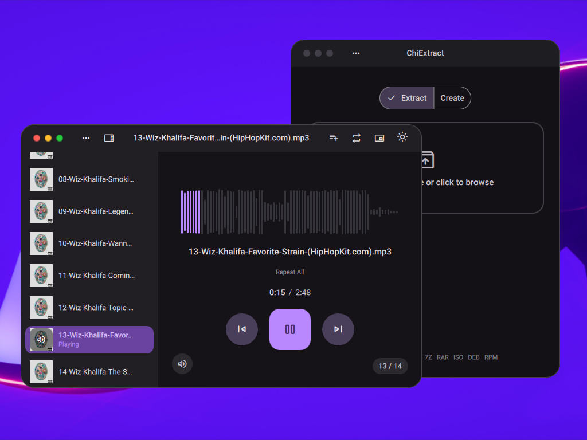
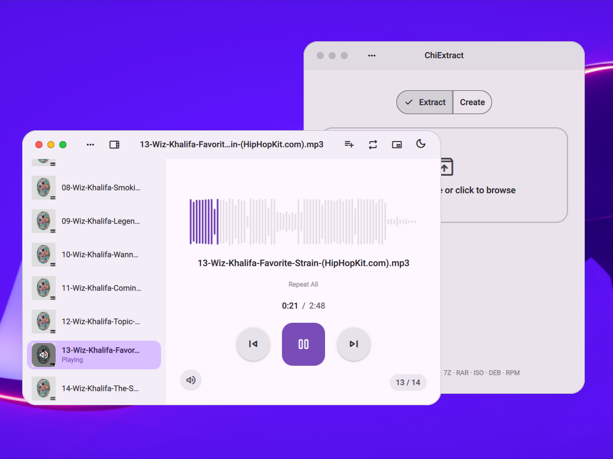

<p align="center">
  <a href="https://bluedesignlive.github.io/Chi/">
    
  </a>
  
  <a href="https://github.com/bluedesignlive/Chi">
    
  </a>
</p>

<h1 align="center">Chi</h1>
<p align="center"><strong>Build beautiful QML applications without thinking about styling.</strong></p>

<p align="center">
  <a href="https://bluedesignlive.github.io/Chi/"><strong>Explore the docs</strong></a> ·
  <a href="https://bluedesignlive.github.io/Chi/#theme"><strong>Theme playground</strong></a> ·
  <a href="https://bluedesignlive.github.io/Chi/#apps"><strong>Apps built with Chi</strong></a>
</p>

<p align="center">
  
  
</p>

```qml
import Chi

ChiApplicationWindow {
    title: "My App"

    Button {
        text: "Do something"
        onClicked: console.log("done")
    }
}
```

That's the whole idea. Import a component, it looks right. Dark mode works. Motion works. The window frame, the headerbar, the menus — handled.

---

## What you get

- **~100 components** — buttons, inputs, navigation, dialogs, tables, pickers
- **Application shell** — frameless window, headerbar, global menu support, auto-hide, focus mode, built-in screenshots and screen recording
- **Motion system** — shared tokens, no random durations hardcoded everywhere
- **Responsive breakpoints** — `context.isCompact`, `context.isExpanded`, etc.
- **Dark mode** — toggle it, everything reacts

---

## Install

```bash
git clone https://github.com/bluedesignlive/Chi.git
cd chi
./install.sh
```

Requires Qt 6.

---

## Status

**Beta.** Some components are polished. Some are rough. The architecture is solid and the API won't change wildly from here. I'm shipping now because six months is long enough to wait for perfect.

---

## Platform

Developed on Linux and BSD. Cross-platform in principle — macOS and Windows should work, but they aren't my daily drivers. If something's broken, open an issue.

---

## Contributing

Issues, PRs, and harsh feedback welcome.

If you add a component, follow the existing pattern: read colors from `ChiTheme`, read durations from `ChiMotion`, don't hardcode anything.
